 <a name="top"></a>
# TFM VIU 2022
## _Tutora: Inmaculada del Valls_
## _Masterando: Enrique Prieto Catalán_

Trabajo Final de Máster de Big Data/Data Science de Enrique Prieto Catalán en el que se va a ejecutar el stack mediante Docker Compose.
* El objetivo es la prueba de concepto de la instalación de la aplicación para Observabilidad del stack en un grupo de servidores.
* En este TFM se realizará la prueba de concepto (PoC) que mostrará las capacidades básicas del Stack Elastic para ingesta de logs que permitan la observabilidad de un grupo de servidores._
 ---
 
<a name="indice"></a>
## Índice de contenidos
1. [ Requisitos y asunciones](#item1)
2. [ Instalación del Stack Elastic](#item2)
   - En este apartado, se instala y arranca un stack elastic con un clúster de un nodo de [Elasticsearch](https://www.elastic.co/guide/en/elasticsearch/reference/7.3/index.html) y una instancia de [Kibana](https://www.elastic.co/guide/en/kibana/7.3/index.html).
3. [ Política de Logs](#item3)
   - Establecemos las directrices de los que queremos hacer con los datos en función de las necesidades.
4. [ Modelado Simple de Logs con Filebeat](#item4)
   - Modelamos los campos y creamos una pipeline de procesos
5. [ Activación de acción](#item5) 
   - Damos órdenes de activación a partir de algunos resultados, comenzando por el envío de un mensaje al operador. 
6. [ Siguientes pasos](#item6)

---

<a name="item1"></a> [Volver a Índice](#indice)
 ### 1. Requisitos y asunciones
- Se basa en la versión 7.17.5 del stack. Configurada en el fichero [.env](../.env).
- Docker y Docker Compose. Se ha probado con docker versión 19.03.2 y docker-compose 1.24.1.
  - Usuarios de Windows y Mac users tendrán Compose instalado automáticamente con Docker para [Windows](https://docs.docker.com/docker-for-windows/install/)/[Mac](https://docs.docker.com/docker-for-mac/install/).
  - Los usuarios de Linux puede leer las [instrucciones de instalación](https://docs.docker.com/compose/install/#install-compose) o pueden instalar vía `pip`:
  
    ```shell
    pip install docker-compose
    ```

- Un mínimo de 4GB de RAM para contenedores. Los usuarios de Mac y Windows deben configurar su máquina virtual Docker para disponer de ese mínimo.

    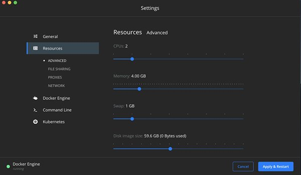

- Debido a que que por defecto la [memoria virtual](https://www.elastic.co/guide/en/elasticsearch/reference/7.3/vm-max-map-count.html) no es suficiente, los usuarios de Linux deben ejecutar el siguiente comando como `root`:

```
sysctl -w vm.max_map_count=262144
```
- Para iniciar el stack, es necesario que no haya ningún servicio arrancado en los puertos 9200, 9300 (elasticsearch), 5601 (kibana).
- Asumimos la instalación del entorno de desarrollo ELK en la plataforma Google Cloud Platform (GCP)

## Entorno Desarrollo ELK en GCP 
La plataforma permite actualmente utilizarla gratuitamente 300$ durante 90 dias, 400$ en caso de tener cuenta con dominio propio registrado (https://cloud.google.com/free). Se puede utilizar distintas cuentas para extender las pruebas. Alternativamente se puede instalar en otros entornos cloud que tengamos acceso, o con máquina virtual en local como VirtualBox, que descarto por la excesiva capacidad de memoria que requiere.

1.	https://console.cloud.google.com/
2.	Pinchamos en "Crear Proyecto" => ·Compute engine· + ·Instancias de VM· + ·Habilitar Engine API" 
3.	Creo una instancia VM en Región europe-southwest1 (Madrid)= zona europe-southwest1-a de uso general serie E2 tipo de máquina e2-mediom (2 CPU virtuales, 4 GB de memoria). Inicialmente 4GB parecen suficientes para una instancia de ElasticSearch (ES), una de Kibana (KB) y una de Filebeat (FB)
4.	Seleccionamos "Centos 8".
5.	Disco de arranque cambiar=>" cambio de Debian a CENTOS 8 por comodidad de uso.
6.	elegimos "Disco persistente equilibrado" y subimos memoria a 100GB. 
7.	Permitir http y https
(AQUÍ IMAGEN)
(AQUÍ IMAGEN)
- Esto luego se puede ejecutar aquí mismo con este comando:
```
gcloud compute instances create enriqueprieto-instancia10 --project=tfm-elastic-cern-uam --zone=europe-southwest1-a --machine-type=e2-medium --network-interface=network-tier=PREMIUM,subnet=default --maintenance-policy=MIGRATE --provisioning-model=STANDARD --service-account=58105659734-compute@developer.gserviceaccount.com --scopes=https://www.googleapis.com/auth/devstorage.read_only,https://www.googleapis.com/auth/logging.write,https://www.googleapis.com/auth/monitoring.write,https://www.googleapis.com/auth/servicecontrol,https://www.googleapis.com/auth/service.management.readonly,https://www.googleapis.com/auth/trace.append --tags=http-server,https-server --create-disk=auto-delete=yes,boot=yes,device-name=enriqueprieto-instancia10,image=projects/centos-cloud/global/images/centos-stream-8-v20220719,mode=rw,size=100,type=projects/tfm-elastic-cern-uam/zones/europe-southwest1-a/diskTypes/pd-balanced --no-shielded-secure-boot --shielded-vtpm --shielded-integrity-monitoring --labels=proyecto=tfm,autor=enrique_prieto --reservation-affinity=any
```
 y pulsando en “ejecutar en cloud shell” en vez de “copiar en portapapeles” (hay que tener instalado el Cloud Shell, cliente de Windows gratuito para todos los usuarios, máximo 50 horas semanales)(Una alternativa es CON EL ICONO SUPERIOR DERECHO “>=” ).
- SE ABRE EN EL MISMO GOOGLE CLOUD Shell TERMINAL CON EL ICONO SUPERIOR DERECHO “>=” 
(AQUÍ IMAGEN)
Tendremos entonces creada la siguiente instancia, que ejecutaremos o pararemos en función del uso, para minimizar su coste:
 ```shell
 NAME: enriqueprieto-centos8-2
 ZONE: europe-southwest1-a
 MACHINE_TYPE: e2-medium
 PREEMPTIBLE:
 INTERNAL_IP: 10.204.0.2
 EXTERNAL_IP: 34.175.205.191
 STATUS: RUNNING
 enrique@cloudshell:~ (tfm-elastic-cern-uam)$
  ```
8. Creo una regla de firewall que permita salida de puerto 80
Commando REST equivalente:

 ```shell
POST https://www.googleapis.com/compute/v1/projects/tfm-elastic-cern-uam/global/firewalls
{
  "kind": "compute#firewall",
  "name": "enri-abrir-puerto80-salida",
  "selfLink": "projects/tfm-elastic-cern-uam/global/firewalls/enri-abrir-puerto80-salida",
  "network": "projects/tfm-elastic-cern-uam/global/networks/default",
  "direction": "EGRESS",
  "priority": 1000,
  "description": "enri-abrir-puerto80",
  "allowed": [
    {
      "IPProtocol": "all"
    }
  ],
  "destinationRanges": [
    "34.175.205.191"
  ]
}
  ```

Esta es la respuesta REST:

  ```shell
{
  "allowed": [
    {
      "IPProtocol": "all"
    }
  ],
  "creationTimestamp": "2022-07-17T12:26:39.194-07:00",
  "description": "enri-abrir-puerto80",
  "destinationRanges": [
    "34.175.205.191"
  ],
  "direction": "EGRESS",
  "disabled": false,
  "enableLogging": false,
  "id": "2176967777015422080",
  "kind": "compute#firewall",
  "logConfig": {
    "enable": false
  },
  "name": "enri-abrir-puerto80-salida",
  "network": "projects/tfm-elastic-cern-uam/global/networks/default",
  "priority": 1000,
  "selfLink": "projects/tfm-elastic-cern-uam/global/firewalls/enri-abrir-puerto80-salida"
}
  ```
  
## CONEXIÓN POR SSH
Para transferir las claves ssh a la máquina virtual y conectarse:
9. En la instancia, columna “Conectar” pinchar

 ```shell 
SSH => abrir en otra ventana del navegador 
  ```
(Esto puede ser guardarse como un grupo de comandos de gcloud  para conectarse directamente a la máquina:
    ```shell
gcloud compute ssh --zone "europe-southwest1-a" "enriqueprieto-centos8-2"  --project "tfm-elastic-cern-uam"
    ```

Y nos podemos conectar desde el propio Cloud Shell de Google cloud en vez de la de Windows. Nos crea automáticamente los directorios, y el usuario de SSH enrique, en la máquina enriqueprieto.centos8-2 pidiendo contraseña que dejamos en blanco.
Probamos su correcto funcionamiento:
 ```shell
ls
pwd
whoami
  ```
## INSTALACIÓN DE GIT Y DOCKER  
A continuación instalamos Git y Docker como superusuario (poniendo SUDO delante), usando la instrucción de la Web https://serverspace.io/support/help/how-to-install-docker-on-centos-8/ (o https://docs.docker.com/engine/install/centos/)

10.	Instalar git https://www.digitalocean.com/community/tutorials/how-to-install-git-on-centos-7 
 ```shell
sudo yum install git
  ```
(yum es para que encuentre la última versión). Responder a la pregunta con Y(es)
11. Comprobamos:
 ```shell
git --version 
  ```
Devuelve si está todo correcto:
 ```shell
git version 2.31.1
  ```
12. Una vez instalado el GIT, clonamos nuestro Git de github:
 ```shell
git clone https://github.com/Peilike2/tfm_bigdata_viu_enriqueprieto.git
  ```
13.	Aseguramos el cumplimiento de requisitos de memoria máxima de linux antes de lanzar docker-compose:
 ```shell
 sudo sysctl -w vm.max_map_count=262144
  ```
(¡ESTO HABRÁ QUE EJECUTARLO CADA VEZ QUE SE REINICIE LA INSTANCIA!)

Usaremos los comandos docker basicos https://dockerlabs.collabnix.com/docker/cheatsheet/ y docker-compose https://devhints.io/docker-compose
Como editor de texto usamos vim.

14. Instalamos Docker pero con “SUDO” delante:
 ```shell
 sudo dnf config-manager --add-repo=https://download.docker.com/linux/centos/docker-ce.repo
   ```
15. Instalamos el Docker package, aceptando dos veces con Y(es) las preguntas que realiza en su proceso:
 ```shell
 sudo dnf install docker-ce docker-ce-cli containerd.io
   ```

16. Arrancamos el servicio Docker y lo añadimos al autorun:
 ```shell
 sudo systemctl enable --now docker
   ```
17. CentOS 8 utiliza un firewall diferente al de Docker. Por lo tanto, al tener firewall habilitado, necesitamos añadir una regla de enmascaramiento a él.
 ```shell
 sudo firewall-cmd --zone=public --add-masquerade --permanent
   ```
 ```shell
 sudo firewall-cmd --reload
   ```

## INSTALACIÓN DE DOCKER-COMPOSE
17. Ahora instalamos  Docker compose, utilidad que permite desplegar el proyecto en otra máquina utilizando un solo comando. Para descargarlo:
 ```shell
 sudo curl -L "https://github.com/docker/compose/releases/download/1.27.4/docker-compose-$(uname -s)-$(uname -m)" -o /usr/local/bin/docker-compose
   ```
 19.  Ahora lo hacemos ejecutable:
 ```shell
 sudo chmod +x /usr/local/bin/docker-compose
   ```
 20.  Lo comprobamos:
 ```shell
 docker-compose -v
   ```
   y nos responde:
 ```shell
 docker-compose version 1.27.4, build 40524192
   ```
   Que indica que funciona correctamente
21. A continuación tratamos de evitar la denegación de servicio aplicando lo expuesto en https://newbedev.com/javascript-got-permission-denied-while-trying-to-connect-to-the-docker-daemon-socket-at-unix-var-run-docker-sock-get-http-2fvar-2frun-2fdocker-sock-v1-24-containers-json-all-1-dial-unix-var-run-docker-sock-connect-permission-denied-a-code-example
Cambiamos el permiso: 
 ```shell
 sudo chmod 666 /var/run/docker.sock
  ```
¡ESTO TENDREMOS QUE EJECUTARLO CADA VEZ QUE ARRAMQUEMOS DE NUEVO LA INSTANCIA DE LA MÁQUINA VIRTUAL!
22. Ahora volvemos a probar docker run hello-world y comprobamos que funciona:
 ```shell
 docker run hello-world
   ```
Recibiremos como confirmación la siguiente respuesta:
 ```shellUnable to find image 'hello-world:latest' locally
latest: Pulling from library/hello-world
2db29710123e: Pull complete
Digest: sha256:53f1bbee2f52c39e41682ee1d388285290c5c8a76cc92b42687eecf38e0af3f0
Status: Downloaded newer image for hello-world:latest

Hello from Docker!
This message shows that your installation appears to be working correctly.
   ```

---

<a name="item2"></a> [Volver a Índice](#indice)
 ### 2. Instalación del Stack Elastic
Trataremos de instalar los servicios necesarios para lograr la siguiente estructura de ejecución: 
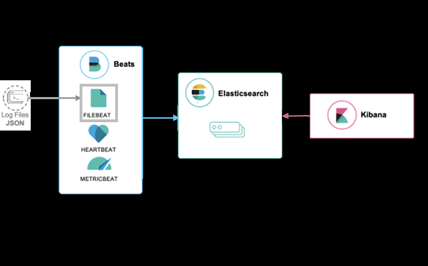

Para ello este apartado efectuaremos lo siguente:
 - Instalar un conjunto de contenedores en los que se encuentra elasticsearch, kibana y filebeat
 - Arrancar dichos servicios, comprobando que funcionan correctamente
 - Probar explorando [Discover](https://www.elastic.co/guide/en/kibana/7.3/discover.html) en Kibana.

## INSTALACIÓN DEL STACK
23. Vamos a /filebeat/config y allí aseguramos los permisos correspondientes:
```shell
cd /filebeat/config/
chmod go-w filebeat.yml
```
24. Después nos aseguramos del borrado de datos anteriores en caso de no ser la primera prueba y arrancamos los contenedores del stack Elasticic definido en [docker-compose.yml](../../docker-compose.yml). Para ello regresamos a la raíz del proyecto y ejecutamos:
```shell
cd PWD
docker-compose down -v
docker-compose up -d
```
A título informativo, se indican las distintas formas de detener y eliminar:
```shell
# Solamente detener los servicios:
docker-compose stop

# Detener y eliminar contenedores, redes,...:
docker-compose down 

# Parar y eliminar volúmenes (directorios donde se indica el guardado persistente de datos):
docker-compose down --volumes 
# Otra forma:
docker-compose down -v

# Parar y eliminar imágenes:
docker-compose down --rmi <all|local> 
```
## COMPROBACIONES
25. Ejecutaremos `docker ps` para comprobar que tenemos 3 contenedores en estado healthy (filebeat, kibana, elasticsearch).

26. Podemos también comprobar si han arrancado correctamente, visualizando los respectivos logs de los distintos servicios:

```shell
docker logs -f elasticsearch
docker logs -f kibana
docker logs -f filebeat
```
27. Por otro lado se puede comprobar la integridad de los yml con herramientas como esta: http://www.yamllint.com/

28. En caso de modificar el fichero de testeo, deberá asegurarse de que el sistema operativo Windows no le ha añadido caracteres ilegibles en UNIX, usando la siguiente instrucción:
```shell
dos2unix test/ficherolog.log
```
Como alternativa se puede usar herramientas online como esta: https://toolslick.com/conversion/text/dos-to-unix

## Visualización vía Logs UI
27. A continuación, abrimos en un navegador la URL de Kibana (ver [supported browsers](https://www.elastic.co/es/support/matrix#matrix_browsers)).

- http://localhost:80/
- Usuario: elastic
- Password: changeme


28. Selecionamos en el menú de la izquierda `Logs`.
(AQUÍ IMAGEN)

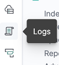

29. Si pulsamos en la esquina superior derecha, `Stream Live`, se actualizarán los logs que llegaron a elasticsearch. En este caso no devería variar, al tratarse de la ingesta de un único fichero y no de una fuente continua de datos (stream)

30. También podemos modificar el tamaño de letra de los logs, si queremos hacer wrapping, etc. con la opción del menú `Customize`.
(COMPROBAR ESTA IMAGEN)

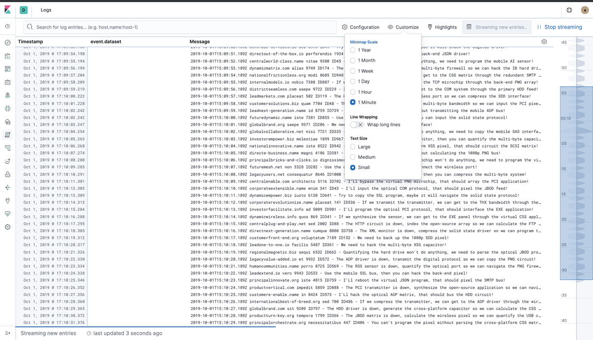

31. Pulsando en `Configuration`, se puede modificar qué [índices](https://www.elastic.co/guide/en/elasticsearch/reference/6.2/_basic_concepts.html#_index) de elasticsearch kibana nos va a mostrar, el campo a usar como `timestamp`, etc. Interesante en la configuración, ir a la segunda pestaña, `Log Columns`, donde podemos indicar qué campos queremos mostrar en la pantalla.

32. Dado que no tenemos el campo `event.dataset`...

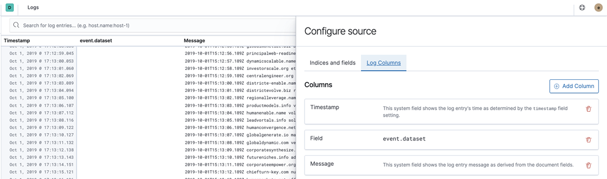

33. ...lo podemos eliminar y guardar con `Update source`.

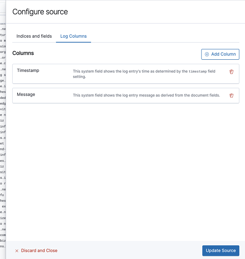

34. A partir de aquí la vista de los logs presentará el siguiente aspecto.

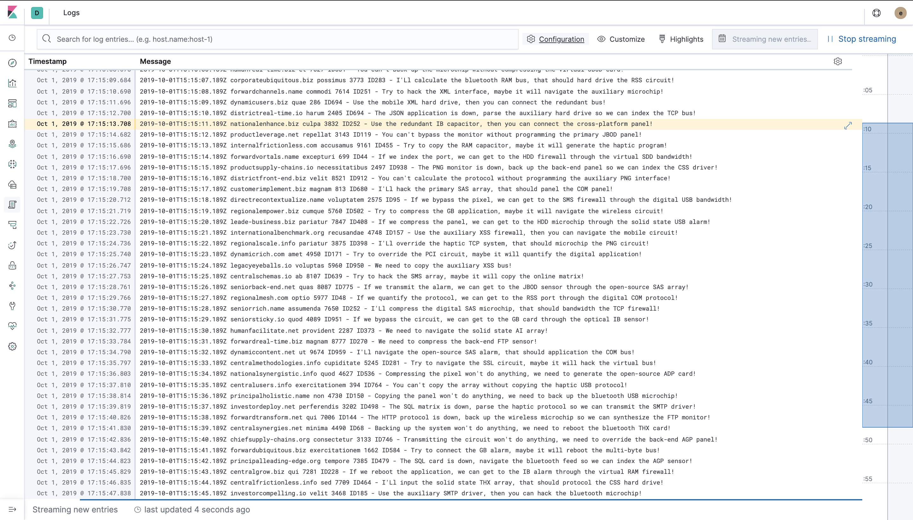

35. Podemos igualmente usar la barra de búsqueda superior para filtrar los logs. En los ejemplos, buscamos el texto `override the driver` o `calculate`.

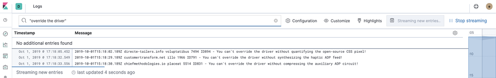
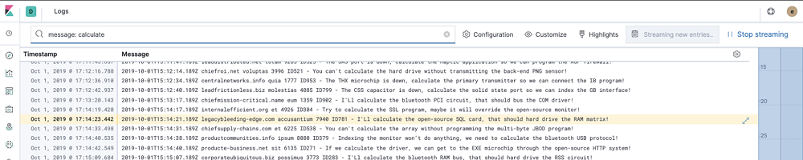

36. Para pasar al siguiente apartado, pararemos filebeat ejecutando:

```shell
docker-compose stop filebeat
```

37. Y en Kibana borraremos el índice generado para los logs de Filebeat. Para ello, selecciona en el menú izquierdo `Management`.

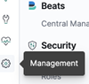

38. Seleccionamos `Index Management` en el grupo Elasticsearch.

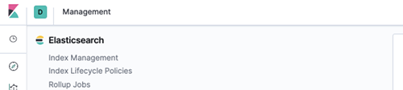

39. Y borramos el índice o índices `filebeat`.

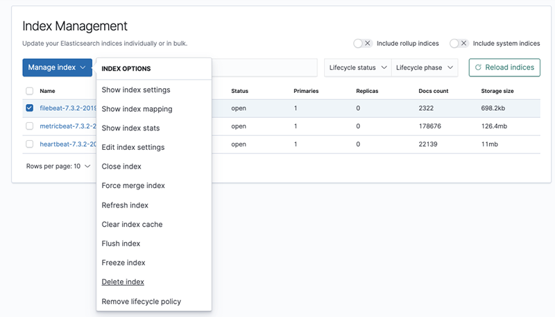
 
[Subir](#top)
 
---

<a name="item3"></a> [Volver a Índice](#indice)
### 3. Política de Logs

Ingestamos en elastic nuestros logs sin modelar, sin estructura. Es decir, dado un log con el formato:
```
27 Dec 2020 03:09:29 () [k6A:2394036:srm2:prepareToGet:-1093710432:-1093710431 k6A:2394036:srm2:prepareToGet SRM-grid002] Pinning failed for /xxxx/xx.xxx.xx/data/atlas/xxxxxxxxxxxxx/rucio/mc16_13TeV/ce/13/EVNT.23114463._000856.pool.root.1 (File is unavailable.)
```

El documento que hemos acabado guardando en Elasticsearch tiene un campo `timestamp` con la fecha de ingesta, y un segundo campo `message` con el mensaje completo del log.

Ahora queremos separar el contenido de este campo `message`, de forma que podamos explotar obtener el `campo01`, el `campo02`, etc. Es decir, darle estructura a los datos que nos llegan.
El mensaje de ejemplo anterior debería transformarse en el siguiente:
```json
{"timestamp":1569939745276,"message":"27 Dec 2020 03:09:29 () [k6A:2394036:srm2:prepareToGet:-1093710432:-1093710431 k6A:2394036:srm2:prepareToGet SRM-grid002] Pinning failed for /xxxx/xx.xxx.xx/data/atlas/xxxxxxxxxxxx/rucio/mc16_13TeV/ce/13/EVNT.23114463._000856.pool.root.1 (File is unavailable.)"}
```
Es decir, aplicarle un valor de fecha a la línea completa, y esta dejarla entera en un único campo llamado "messagge"

Es decir, queremos aplicarle las siguientes operaciones:
1. Seleccionar las líneas que contengan "unavailable"
2. Seleccionar las líneas que contengan "root" en la dirección url del mensaje
3. Extraer dicha url de cada mensaje, aladirle el prefijo "srm://xxxxxxx.xx.xxx.xx:xx/srm/managerv2?SFN=" y que dicha concatenación esa el valor de un nuevo campo
```
srm://xxxxxxx.xx.xxx.xx:xx/srm/managerv2?SFN=/xxxx/xx.xxx.xx/data/atlas/xxxxxxxxxxx/rucio/mc16_13TeV/ce/13/EVNT.23114463._000856.pool.root.1
```
4. Eliminar filas duplicadas

<!-- Esto es un comentario de prueba de Enrique -->

Ejemplo de referencia multilínea [^nota1].  

Así podremos agrupar valores similares, visualizarlos, y explotar toda la potencia de nuestros logs. Nos permitirá contestar preguntas como ¿Cuáles son los errores más habituales?¿cuánta es su repetición? ¿En qué momentosa se producen? (`campo 01`, `campo02`, ...).

Para ello necesitaremos modelar, es decir conocer la **estructura** de nuestros logs, e indicársela a Elasticsearch.

[Subir](#top)

---

<a name="item4"></a> [Volver a Índice](#indice)
### 4. Modelado Simple de Logs con Filebeat
En este punto, el documento que llega a elastic tiene este aspecto:
```json
{"timestamp" : 1569846065739,
"message" : "srm://xxxxxxx.xx.xxx.xx:xx/srm/managerv2?SFN=/xxxx/xx.xxx.xx/data/atlas/xxxxxxxxxxxx/rucio/mc16_13TeV/ce/13/EVNT.23114463._000856.pool.root.1"}
```

Y nos gustaría que en elastic se guardara como:

```json
{
          "@timestamp" : "30 Dec 2020 01:56:30",
          "enri_campo02" : "()",
          "enri_campo03" : "[3Bs:6871:srm2:prepareToGet:-1093078942:-1093078941 3Bs:6871:srm2:prepareToGet",
          "enri_campo04" : "[3Bs:6871:srm2:prepareToGet",
          "enri_campo05" : "SRM-grid002]",
          "enri_campo06" : "Pinning",
          "enri_campo07" : "failed",
          "enri_campo08" : "for",
          "enri_campo09" : "/xxxx/xx.xxx.xx/data/ops/nagios-argo-mon.xxx.xxx-xxx.hr/arcce/srm-input",
          "enri_campo010" : "(File",
          "enri_campo011" : "is ",
          "enri_campo012" : "unavailable.)",
          "enri_campo013" : "",
          "enri_prefifo" : "srm://xxxxxxx.xx.xxx.xx:xx/srm/managerv2?SFN=",
          "enri_prefijo_mas_ruta" : "srm://xxxxxxx.xx.xxx.xx:xx/srm/managerv2?SFN=",
          "timestamp" : 1569846065739
}
```

Para realizar esta transformación, recurriremos a las [pipelines](https://www.elastic.co/guide/en/elasticsearch/reference/7.3/pipeline.html) de ingesta de elasticsearch, que se ejecutarán en los [nodos llamados de ingesta](https://www.elastic.co/guide/en/elasticsearch/reference/7.3/ingest.html).

Dado que tenemos un cluster elasticsearch con un solo nodo, este nodo realizará todos los roles (master, data, ingest, etc.).
(Más información sobre roles de los nodos en la [documentación](https://www.elastic.co/guide/en/elasticsearch/reference/7.3/modules-node.html).

Las pipelines de ingesta proporcionan a elasticsearch un mecanismo para procesar previamente los documentos antes de almacenarlos. Con una pipeline, podemos analizar sintácticamente, transformar y enriquecer los datos de entrada a través de un conjunto de [procesadores](https://www.elastic.co/guide/en/elasticsearch/reference/7.3/ingest-processors.html) que se aplican de forma secuencial a los documentos de entrada, para generar el documento definitivo que almacenará elasticsearch.

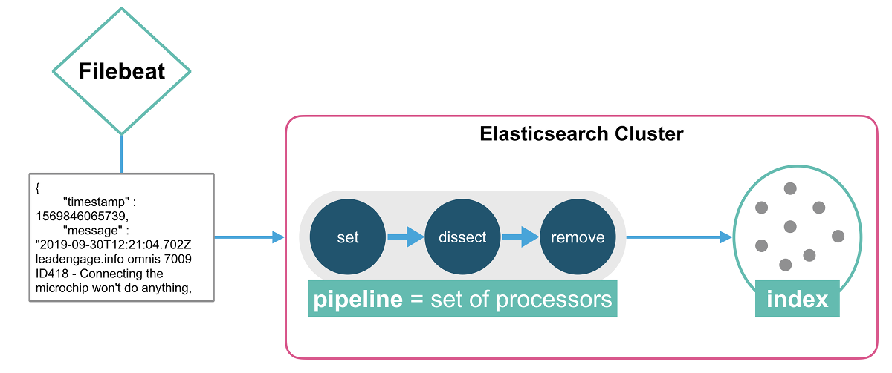

En este apartado realizaremos:

1. Ingesta de logs estruturados usando la pipeline de ingesta de elasticsearch.
2. Visualización de logs en Kibana Discover.

## Creación de la pipeline de ingesta

En primer lugar, vamos a crear una simple pipeline de ingesta, basada en un procesador de tipo [dissect](https://www.elastic.co/guide/en/elasticsearch/reference/7.3/dissect-processor.html), que nos parseará el campo `message` de entrada generando los diversos campos que queremos a la salida (`process_name`, `process_id`, `host_name`, etc).

Antes de crear esta pipeline, es interesante simular cual sería su comportamiento. Para ello, en Kibana seleccionaremos en el menú de la izquierda `Dev Tools`.

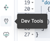

Y pegaremos lo siguiente en la consola:

```json
POST _ingest/pipeline/_simulate
{
  "pipeline": {
    "description": "_description",
    "processors": [
      {
        "dissect": {
          "field": "message",
          "pattern": "%{@timestamp} %{host_name} %{process_name} %{process_id} %{message_id} %{event_data} %{message_content}"
        }
      },
      {
        "remove": {
          "field": "message"
        }
      }
    ]
  },
  "docs": [
    {
      "_source": {
        "timestamp" : 1569846065739,
        "message" : "2019-09-30T12:21:04.702Z leadengage.info omnis 7009 ID418 - Connecting the microchip won't do anything, we need to override the auxiliary PNG protocol!"
      }
    }
  ]
}
```

Al ejecutar esta petición, podremos comprobar si el JSON resultante es el esperado.

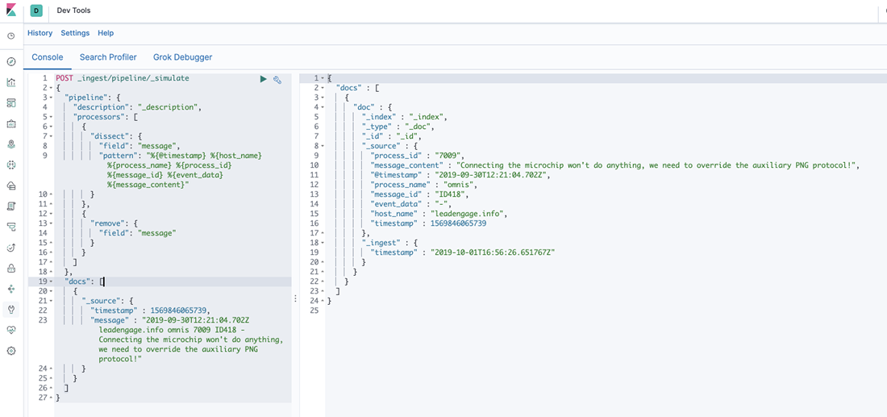

Esta petición [simula](https://www.elastic.co/guide/en/elasticsearch/reference/7.3/simulate-pipeline-api.html) una pipeline, usando el endpoint del API REST de elasticsearch `_ingest/pipeline/_simulate`. En el contenido del cuerpo, tenemos un JSON con los procesadores de la pipeline:

- [**dissect**](https://www.elastic.co/guide/en/elasticsearch/reference/7.3/dissect-processor.html): Se encarga de separar el texto que viene en el campo message a partir de los espacios en blanco, y crea distintos campos (timestamp, host_name, process_name, etc.) con los valores que extrae del campo message de entrada.
- [**remove**](https://www.elastic.co/guide/en/elasticsearch/reference/7.3/remove-processor.html): eliminará el campo `message` ya que, una vez modelado, no nos interesa guardara esta información redundante.

Una vez comprobamos que la pipeline de ingesta funciona según deseamos, la daremos de alta en elasticsearch para poder usarla. Para ello, en la misma consola de Dev Tools, ejecutaremos:

```json
PUT _ingest/pipeline/logs-pipeline
{
  "description": "Pipeline para TFM",
  "processors": [
    {
      "dissect": {
        "field": "message",
        "pattern": "%{@timestamp} %{enri_campo02} %{enri_campo03} %{enri_campo04} %{enri_campo05} %{enri_campo06} %{enri_campo07} %{enri_campo08} %{enri_campo09} %{enri_campo10} %{enri_campo11} %{enri_campo12}"
      }
    },
    {
      "set": {
        "field": "enri_prefijo",
        "value": "srm://grid002.ft.uam.es:8443/srm/managerv2?SFN="
      }
    },
   {
      "append": {
        "field": "enri_prefijo_mas_ruta",
        "value": [
          "{{enri_prefijo}}",
          "{{enri_campo12}}"
        ]
      }
    },
   {
      "join": {
        "field": "enri_prefijo_mas_ruta",
        "separator": ""
      }
    },
    {
      "remove": {
        "field": "message"
      }
    }
  ]
}
```

Creando la pipeline de ingesta **logs-pipeline**, que usaremos en el próximo apartado.

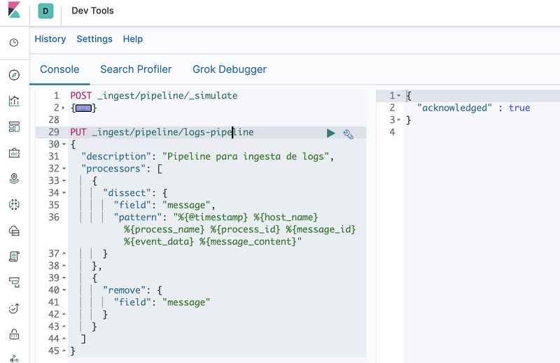

## Configuracion de Filebeat

Ahora tenemos que indicar a elasticsearch que los documentos que vayan a ser almacenados en los índices creados por filebeat deben pasar primero esta pipeline que los va a transformar. Para ello, hemos editado el fichero de configuración de filebeat. [filebeat/config/filebeat.yml](../../filebeat/config/filebeat.yml), y en la sección `output.elasticsearch` hemos descomentado la línea `pipeline: logs-pipeline`.

```yaml
output.elasticsearch:
  hosts: ["elasticsearch:9200"]
  username: '${ES_USERNAME:elastic}'
  password: '${ES_PASSWORD:changeme}'
  pipeline: logs-pipeline
```

## Ingesta de logs estructurados

Arrancamos de nuevo `filebeat`.

```shell
docker-compose up -d
```

Podemos comprobar que no haya errores en la ejecución de filebeat, antes de pasar al siguiente apartado:

```shell
docker logs -f filebeat
```

## Visualizar logs en Discover

Volvemos a Kibana.

Para visualizar los logs debemos primero crear un [Index Pattern](https://www.elastic.co/guide/en/kibana/7.3/tutorial-define-index.html). Los index patterns nos permiten acceder desde Kibana a los índices en elasticsearch, y, por lo tanto, a los documentos que tenemos almacenados en estos índices.

Si no le indicamos lo contrario en la configuración de filebeat para envío a elasticsearch, los índices que se crearán son con el nombre `filebeat-*`.

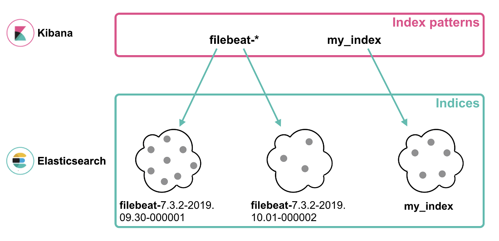

Por lo tanto, en la sección de Management de Kibana, seleccionamos `Index Patterns` en el grupo `Kibana`.

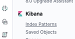

Pulsamos el botón azul `Create Index Pattern` y damos de alta un patrón `filebeat-*`.

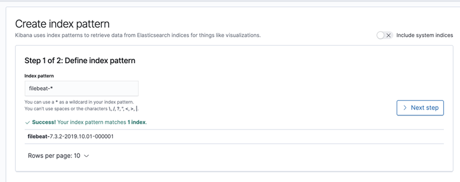

Hacemos clic en `Next step`y seleccionaremos el campo a usar para mostrar la serie temporal de datos en Discover. En
este caso, escogemos `@timestamp`.

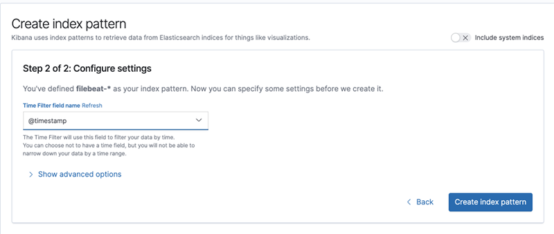

Y pulsamos `Create Index Pattern`.

Seleccionamos en el menú de la izquierda en Kibana `Discover`.

Hacemos clic en `New` en el menú superior, para limpiar cualquier filtro que tuviéramos en la búsqueda.

Y en el selector escogemos el index pattern que acabamos de crear, `filebeat-*`.

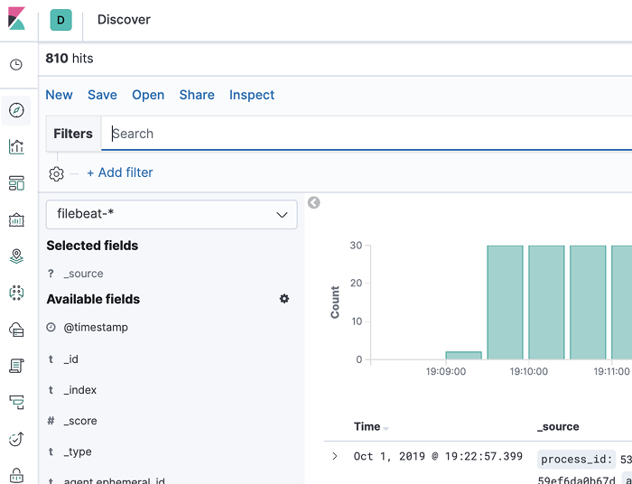

Usamos la barra de búsqueda para filtrar nuestros datos. filtramos por `enri_campo12: "Unavailable" and not enri_campo09: "*root"`
(CAMBIAR IMAGEN)
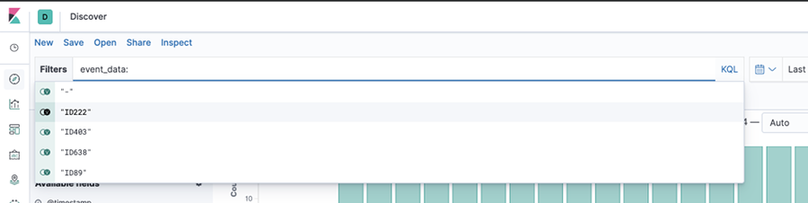
(CAMBIAR IMAGEN)
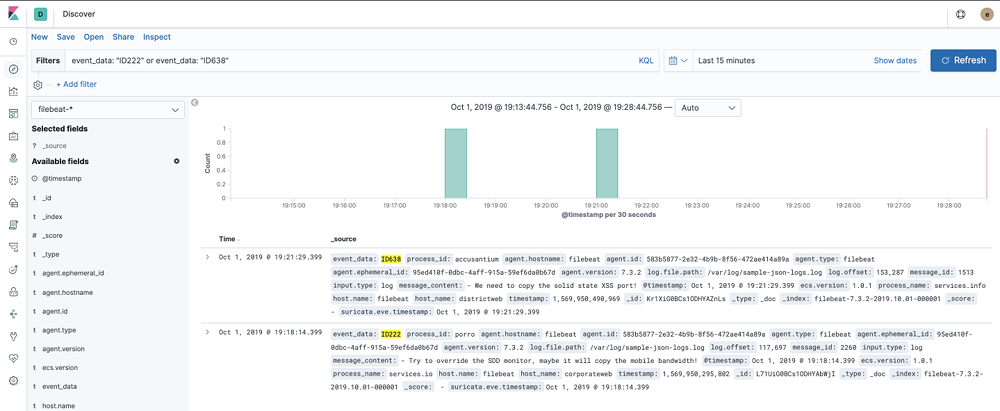

El lenguage usado para filtrar las búsquedas es [Kibana Query Language (KQL)](https://www.elastic.co/guide/en/kibana/7.3/kuery-query.html).


Pulsamos el botón `Save` en la barra superior y guardaremos la búsqueda con el nombre `[Filebeat] Host/Process`

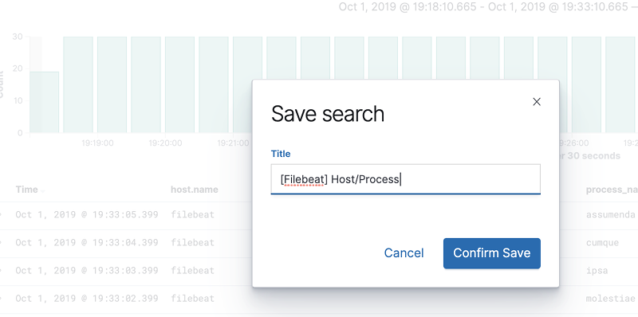


## Finalizamos

---

<a name="item5"></a> [Volver a Índice](#indice)
 ### 5. [ Activación de acción](#item5) 
   - Damos órdenes de activación a partir de algunos resultados, comenzando por el envío de un mensaje al operador. 
   - 
   - 
   - 
   - 

---

<a name="item6"></a> [Volver a Índice](#indice)
 ### 6.  Siguientes pasos 
   - 
   - 
   - 
   - 
   - 
   - 
   - 
   -
   -   
   -   


---
[^nota1]: Cada línea extrade estas notas empicezan con doble espacio.  
  Esta línea empezó con doble espacio.
[^nota2]: vista de [Discover](https://www.elastic.co/guide/en/kibana/7.3/discover.html) en Kibana
[^nota3]: Prueba

[Subir](#top)

