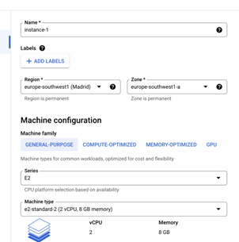
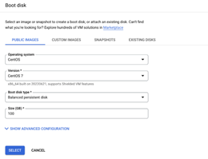
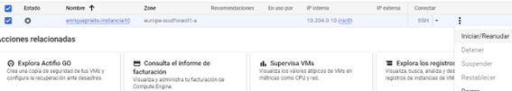
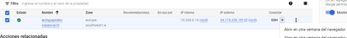
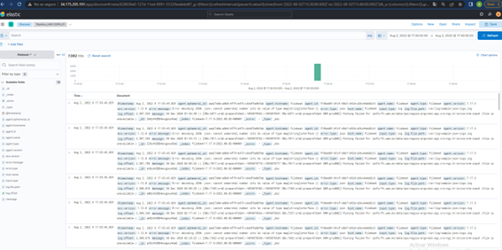

 <a name="top"></a>
# TFM VIU 2022
## _Tutora: Inmaculada del Valls_
## _Masterando: Enrique Prieto Catalán_

Trabajo Final de Máster de Big Data/Data Science de Enrique Prieto Catalán en el que se va a ejecutar el stack mediante Docker Compose.
* El objetivo es la prueba de concepto de la instalación de la aplicación para Observabilidad del stack en un grupo de servidores.
* En este TFM se realizará la prueba de concepto (PoC) que mostrará las capacidades básicas del Stack Elastic (https://www.elastic.co/guide/en/elasticsearch/reference/7.3/index.html) para ingesta de logs que permitan la observabilidad de un grupo de servidores gracias a kibana (https://www.elastic.co/guide/en/kibana/7.3/index.html).
 ---
 
<a name="indice"></a>
## Índice de contenidos
1. [ REQUISITOS Y ASUNCIONES](#item1)
2. [ ENTORNO DE DESARROLLO ELK EN GCP](#item2)
3. [ CONEXIÓN POR SSH. INSTALACIÓN DE DNF Y DOCKER](#item3)
4. [ INSTALACIÓN DE DOCKER-COMPOSE](#item4)
5. [ INSTALACIÓN DE GIT](#item5)
6. [ INSTALACIÓN DEL STACK ELASTIC](#item6)
7. [ VISUALIZACIÓN CON KIBANA. CREACIÓN DE INDEX PATTERN](#item7)
8. [ REINICIO DE LA INSTANCIA DE MÁQUINA VIRTUAL (VM)](#item8)
   - Pasos a realizar de nuevo cada vez que se detenga y vuelva a arrancar la instancia de Máquina Virtual (MV).
9. [ SIMULACIÓN DE PIPELINE DE PROCESADO DE LOGS](#item9)
   - Modelado de los campos para la pipeline, y comprobación de salidas en entorno de prueba.
10. [ ALTA DE LA PIPELINE DE PROCESADO DE LOGS](#item10)
   -  Creación de la pipeline de procesos. Alta en Elastic.
11. [ PROGRAMACIÓN DE EJECUCIÓN DE LA PIPELINE DE PROCESADO DE LOGS](#item11)
   -  Direccionamiento desde filebeat, de los datos hacia los procesos de la pipeline.
12. [ ACTIVACIÓN DE ACCIÓN](#item12) 
   - Emisión de órdenes de activación a partir de algunos resultados, comenzando por el envío de un mensaje al operador. 
13. [ SIGUIENTES PASOS](#item13)

---

<a name="item1"></a> [Volver a Índice](#indice)
 ### 1. REQUISITOS Y ASUNCIONES
- Se asume la instalación del entorno de desarrollo ELK en la plataforma Google Cloud Platform (GCP)
- Se basa en la versión 7.17.5 del Stack Elastic (ELK). Configurada en el fichero [.env](../.env) para funcionar con la última versión 7:
  ```shell
  vim .env
  ELK_VERSION=7.17.5
  Ctrl+c
  !qw
  ```
- Instalación de Docker Compose. Se ha probado con  docker-compose 1.27.4
  En el caso que se describe, desde Google Cloud Platform, se indica más adelante cómo se realiza. En cambio, para el caso de instalación local directa sería de la siguiente forma:
  - Usuarios de Windows y Mac users tendrán Compose instalado automáticamente con Docker para [Windows](https://docs.docker.com/docker-for-windows/install/)/[Mac](https://docs.docker.com/docker-for-mac/install/).
  - Los usuarios de Linux ejecutarán la siguiente instrucción para instalar vía `pip`, pudiendo seguir las [instrucciones de instalación](https://docs.docker.com/compose/install/#install-compose):
    ```shell
    pip install docker-compose
    ```

- Un mínimo de 4GB de RAM [memoria virtual](https://www.elastic.co/guide/en/elasticsearch/reference/7.3/vm-max-map-count.html) para contenedores. En este caso, desde Google Cloud Platform, se indican más adelante los pasos. En caso de que se hubiera instalado directamente en local, los usuarios de Mac y Windows deberían configurar su máquina virtual Docker para disponer de ese mínimo de la siguiente manera:

    

 Y los usuarios de Linux, en ese caso, deberían ejecutar el siguiente comando como `root`:

```
sysctl -w vm.max_map_count=262144
```
Sin embargo, se indica más adelante cómo proceder para el caso de este proyecto, desde GCP.
- Sistema operativo probado CentOS 8
- Git version 2.31.1
- Kibana 7.3
- Por último, para iniciar el Stack, es necesario que no haya ningún servicio arrancado en los puertos 9200, 9300 (elasticsearch), 5601 (kibana).

---

<a name="item2"></a> [Volver a Índice](#indice) 
### 2. ENTORNO DE DESARROLLO ELK EN GCP  
La plataforma permite actualmente su uso gratuito hasta un coste de 300$ durante 90 dias, 400$ en caso de tener cuenta con dominio propio registrado (https://cloud.google.com/free). Se pueden utilizar distintas cuentas para extender las pruebas. Alternativamente se puede instalar en otros entornos cloud de los que se disponga acceso, o con máquina virtual en local como VirtualBox, que se ha descartado por la excesiva capacidad de memoria que requiere.

1.	Arrir navegador y ejecutar la dirección https://console.cloud.google.com/
2.	Cliquear en "Crear Proyecto" => *Compute engine* + *Instancias de VM* + *Crear Proyecto* + *Nombre:"TFM Elastic CERN UAM" Organización:"sin organización"* + *Crear* + *Habilitar Engine API* + *Crear Instancia*
3.	Se crea una instancia VM en Región europe-southwest1 (Madrid)= zona europe-southwest1-a de uso general serie E2 tipo de máquina e2-mediom (2 CPU virtuales, 4 GB de memoria). Inicialmente 4GB son suficientes para una instancia de ElasticSearch (ES), una de Kibana (KB) y una de Filebeat (FB)

    
4.	Se selecciona "Centos 8" por mayor conveniencia de uso (Disco de arranque: *cambiar* + Versión: *CentOS Stream 8*.
5.	Elección de "Disco persistente equilibrado" y fijado de memoria a 100GB. 
(AQUÍ IMAGEN)

    
6.	Permitir http y https
(AQUÍ IMAGEN)
7. Clik en *Crear*
- Esto luego se puede ejecutar aquí mismo con este comando REST:
```
gcloud compute instances create tfm-enrique-prieto --project=tfm-elastic-cern-uam-360608 --zone=europe-southwest1-a --machine-type=e2-medium --network-interface=network-tier=PREMIUM,subnet=default --maintenance-policy=MIGRATE --provisioning-model=STANDARD --service-account=746661842685-compute@developer.gserviceaccount.com --scopes=https://www.googleapis.com/auth/devstorage.read_only,https://www.googleapis.com/auth/logging.write,https://www.googleapis.com/auth/monitoring.write,https://www.googleapis.com/auth/servicecontrol,https://www.googleapis.com/auth/service.management.readonly,https://www.googleapis.com/auth/trace.append --tags=http-server,https-server --create-disk=auto-delete=yes,boot=yes,device-name=tfm-enrique-prieto,image=projects/centos-cloud/global/images/centos-stream-8-v20220822,mode=rw,size=100,type=projects/tfm-elastic-cern-uam-360608/zones/europe-southwest1-a/diskTypes/pd-balanced --no-shielded-secure-boot --shielded-vtpm --shielded-integrity-monitoring --labels=proyecto=tfm,fecha=26-08-2022,autor=enrique-prieto --reservation-affinity=any
```
 y pulsando en “ejecutar en cloud shell” en vez de “copiar en portapapeles” (hay que tener instalado el Cloud Shell, cliente de Windows gratuito para todos los usuarios, máximo 50 horas semanales)(Una alternativa es CON EL ICONO SUPERIOR DERECHO “>=” ).
- SE ABRE EN EL MISMO GOOGLE CLOUD Shell TERMINAL CON EL ICONO SUPERIOR DERECHO “>=” 
(AQUÍ IMAGEN cloud shell))
Se obtiene entonces la siguiente instancia creada, que habrá que ejecutar o detener (menú hamburguesa a la derecha de SSH, "Detener"), en función del uso, procurando minimizar su coste:
 ```shell
 NAME: enriqueprieto-centos8-2
 ZONE: europe-southwest1-a
 MACHINE_TYPE: e2-medium
 PREEMPTIBLE:
 INTERNAL_IP: 10.204.0.2
 EXTERNAL_IP: 34.175.205.191
 STATUS: RUNNING
 enrique@cloudshell:~ (tfm-elastic-cern-uam)$
  ```

   
   
8. A continuación se crea una regla de firewall que permita entrada de puerto 80. Pulsar los tres puntos a la derecha de la instancia + *Ver detalles de red* + Columna izquiera *Firewall* + *Create Firewall Policy* + Nombre:xxx + *Continuar* + *Agegar regla* + Prioridad: 1000 + Dirección del tráfico: *Entrada* + Rangos de IPv4 de destino: poner la ip de la instancia "34.175.112.47 " + *crear* + *continuar* + *asociar* + seleccionar la red default + *asociado* + *Continuar* + *crear*

(AQUÍ IMAGEN Ver detalles de la red para el firewall)

(AQUÍ IMAGEN CONFIGURACIÓN FIREWALL1)

(AQUÍ IMAGEN CONFIGURACIÓN FIREWALL1

Commando REST equivalente:

 ```shell
POST https://www.googleapis.com/compute/v1/projects/tfm-elastic-cern-uam/global/firewalls
{
  "kind": "compute#firewall",
  "name": "enri-abrir-puerto80-salida",
  "selfLink": "projects/tfm-elastic-cern-uam/global/firewalls/enri-abrir-puerto80-entrada",
  "network": "projects/tfm-elastic-cern-uam/global/networks/default",
  "direction": "INGRESS",
  "priority": 1000,
  "description": "enri-abrir-puerto80",
  "allowed": [
    {
      "IPProtocol": "all"
    }
  ],
  "destinationRanges": [
    "34.175.205.191"
  ]
}
  ```

Esta es la respuesta REST:

  ```shell
{
  "allowed": [
    {
      "IPProtocol": "all"
    }
  ],
  "creationTimestamp": "2022-07-17T12:26:39.194-07:00",
  "description": "enri-abrir-puerto80",
  "destinationRanges": [
    "34.175.205.191"
  ],
  "direction": "INGRESS",
  "disabled": false,
  "enableLogging": false,
  "id": "2176967777015422080",
  "kind": "compute#firewall",
  "logConfig": {
    "enable": false
  },
  "name": "enri-abrir-puerto80-salida",
  "network": "projects/tfm-elastic-cern-uam/global/networks/default",
  "priority": 1000,
  "selfLink": "projects/tfm-elastic-cern-uam/global/firewalls/enri-abrir-puerto80-salida"
}
  ```

---

<a name="item3"></a> [Volver a Índice](#indice) 
### 3. CONEXIÓN POR SSH. INSTALACIÓN DE DNF Y DOCKER 
Para conectarse a la instancia de Máquina Virtual a través de conexión segura SSH:
9. En la columna “Conectar” de la instancia,  se cliquea:

 ```shell 
SSH => abrir en otra ventana del navegador 
 ```
Esto puede guardarse como un grupo de comandos de gcloud  para conectarse directamente a la máquina (se ejecuta desde cliente CLI de Windows, o directamente desde la interfaz de GCP arriba a la derecha, el Cloud Shell de Google cloud, con 50 horas iniciales gratuitas):
 ```shell
gcloud compute ssh --zone "europe-southwest1-a" "enriqueprieto-centos8-2"  --project "tfm-elastic-cern-uam"
 ```

Crea automáticamente los directorios, y el usuario de SSH (en este caso auaenrique), en la máquina enriqueprieto.centos8-2 pidiendo contraseña que se deberá dejar en blanco.



10. Se pueden ejecutar a continuación los siguientes comandos para comprobar su correcto funcionamiento:
 ```shell
ls
pwd
whoami
 ```
 Las instrucciones que se comentan a partir de ahora se entienden introducidas en la ventana de esta conexión establecida.
 
11.  Instalación de dnf:

```shell
sudo yum install dnf
(y)
   ```

12. Instalación de plugins:

```shell
 sudo yum install dnf-plugins-core
 ```
    
13. Instalación de Docker. Deberá en este caso utilizarse “SUDO” delante:

```shell
 sudo dnf config-manager --add-repo=https://download.docker.com/linux/centos/docker-ce.repo
   ```

14. Se instala el Docker package, aceptando dos veces con Y(es) las preguntas que realiza en su proceso:

```shell
 sudo dnf install docker-ce docker-ce-cli containerd.io
 (y)
 (y)
   ```

15. Se procede a arrancar el servicio Docker y añadírselo al autorun:

```shell
 sudo systemctl enable --now docker
   ```

16. CentOS 8 utiliza un firewall diferente al de Docker. Por lo tanto, al tener firewall habilitado, se requiere añadir una regla de enmascaramiento hacia él.

```shell
 sudo firewall-cmd --zone=public --add-masquerade --permanent
   ```
 ```shell
 sudo firewall-cmd --reload
   ```

---

<a name="item4"></a> [Volver a Índice](#indice) 
### 4. INSTALACIÓN DE DOCKER-COMPOSE
17. En este punto se instala  Docker-compose, servicio que permite desplegar el proyecto en otra máquina utilizando un solo comando. Para descargarlo:
 ```shell
 sudo curl -L "https://github.com/docker/compose/releases/download/1.27.4/docker-compose-$(uname -s)-$(uname -m)" -o /usr/local/bin/docker-compose
   ```
18.  A continuación se le da carácter ejecutable:
 ```shell
 sudo chmod +x /usr/local/bin/docker-compose
   ```
19.  Procediendo a su comprobación posterior:
 ```shell
 docker-compose -v
   ```
   obteniendo como respuesta de confirmación:
 ```shell
 docker-compose version 1.27.4, build 40524192
   ```
   lo cual indica que funciona correctamente.
   
20. Seguidamente se evitará la denegación de servicio aplicando lo expuesto en 
https://newbedev.com/javascript-got-permission-denied-while-trying-to-connect-to-the-docker-daemon-socket-at-unix-var-run-docker-sock-get-http-2fvar-2frun-2fdocker-sock-v1-24-containers-json-all-1-dial-unix-var-run-docker-sock-connect-permission-denied-a-code-example
Para lo cual habrá que cambiar el siguiente permiso: 

```shell
 sudo chmod 666 /var/run/docker.sock
  ```

Esto será preciso ejectutarlo cada vez que se arranque de nuevo la instancia de la máquina virtual.

21. Posteriormente se prueba ejecutando docker run hello-world y comprobandos que funciona:

```shell
 docker run hello-world
   ```

Recibiendo como confirmación la siguiente respuesta:

```shellUnable to find image 'hello-world:latest' locally
latest: Pulling from library/hello-world
2db29710123e: Pull complete
Digest: sha256:53f1bbee2f52c39e41682ee1d388285290c5c8a76cc92b42687eecf38e0af3f0
Status: Downloaded newer image for hello-world:latest

Hello from Docker!
This message shows that your installation appears to be working correctly.
This message shows that your installation appears to be working correctly.

To generate this message, Docker took the following steps:
 1. The Docker client contacted the Docker daemon.
 2. The Docker daemon pulled the "hello-world" image from the Docker Hub.
    (amd64)
 3. The Docker daemon created a new container from that image which runs the
    executable that produces the output you are currently reading.
 4. The Docker daemon streamed that output to the Docker client, which sent it
    to your terminal.

To try something more ambitious, you can run an Ubuntu container with:
 $ docker run -it ubuntu bash

Share images, automate workflows, and more with a free Docker ID:
 https://hub.docker.com/

For more examples and ideas, visit:
 https://docs.docker.com/get-started/
   ```
   
---

<a name="item5"></a> [Volver a Índice](#indice) 
### 5. INSTALACIÓN DE GIT
A continuación se instalan Git y Docker como superusuario (poniendo SUDO delante), usando la instrucción de la Web https://serverspace.io/support/help/how-to-install-docker-on-centos-8/ (o https://docs.docker.com/engine/install/centos/)

22.	Instalar git, por tener los contenedores subidos y compartidos en Github (más información en https://www.digitalocean.com/community/tutorials/how-to-install-git-on-centos-7 )

```shell
sudo yum install git
(y)
 ```

(yum se encarga de solicitar la última versión). Responder a la pregunta con Y(es)
23. Se comprueba con lo siguiente:

```shell
git --version 
 ```

Devolviendo, si está todo correcto:

```shell
git version 1.8.3.1
 ```

24. Una vez instalado el GIT, se clonará el Git instalado previamente en github:

```shell
git clone https://github.com/Peilike2/tfm_bigdata_viu_enriqueprieto.git
 ```

25.	Antes de lanzar docker-compose se deberá asegurar el cumplimiento de requisitos de memoria máxima de linux, como se indicó en el apartado "requisitos":

```shell
 sudo sysctl -w vm.max_map_count=262144
 ```

Lo cual habrá que ejecutar cada vez que se reinicie la instancia tras una parada.

A modo informativo, se usarán comandos docker basicos descritos en https://dockerlabs.collabnix.com/docker/cheatsheet/ además de los comandos de docker-compose detalados en https://devhints.io/docker-compose y como editor de texto se utiliza vim.
 
---

<a name="item6"></a> [Volver a Índice](#indice) 
### 6. INSTALACIÓN DEL STACK ELASTIC
En este apartado se instalan los servicios necesarios para lograr la siguiente estructura de ejecución: 


Para ello se efectuarán las siguentes acciones:
 - Instalar un conjunto de contenedores en los que se encuentra elasticsearch, kibana y filebeat
 - Arrancar dichos servicios, comprobando que funcionan correctamente
 - Probar explorando [Discover](https://www.elastic.co/guide/en/kibana/7.3/discover.html) en Kibana.

26. Personalización de docker-compose.yml
 - En dicho fichero de configuración del mencionado git, se ha limpiado toda referencia a contenedores no usados, dejando exclusivamente elasticsearch, filebeat y kibana
 - Además, en el apartado kibana se ha redirigido el puerto al 80 con "80:5601"
 - Tras su edición, ya incorporada en el git, se puede comprobar la integridad de este y otros ficheros ".yml" con herramientas como esta online: http://www.yamllint.com/

27. Se procede al aseguramiento de los permisos correspondientes a /filebeat/config  (siendo tfm_bigdata_viu_enriqueprieto el directorio del proyecto:

```shell
cd tfm_bigdata_viu_enriqueprieto/filebeat/config/
chmod go-w filebeat.yml
```

28. Después se garantiza el borrado de datos anteriores (para el caso de no ser la primera prueba) a la vez que el arranque de los contenedores del stack Elasticic definido en [docker-compose.yml](../../docker-compose.yml). Para ello se accede a la raíz del proyecto y se ejecuta lo siguiente:

```shell
cd $pwd
cd tfm_bigdata_viu_enriqueprieto
docker-compose down -v
docker-compose up -d --remove-orphans
```

A título informativo, se indican las distintas formas de detener y eliminar:
```shell
# Solamente detener los servicios:
docker-compose stop

# Detener y eliminar contenedores, redes,...:
docker-compose down 

# Parar y eliminar volúmenes (directorios donde se indica el guardado persistente de datos):
docker-compose down --volumes 
# Otra forma:
docker-compose down -v

# Parar y eliminar imágenes:
docker-compose down --rmi <all|local> 

# Con "--remove-orphans" eliminarán en su caso los contenedores que hubieran sido creados anteriormente y que ya no estén registrados en docker-compose.yml
```
## COMPROBACIONES
29. Se ejecuta `docker ps` para comprobar que los tres contenedores se encuentran en estado saludable o "healthy" (filebeat, kibana, elasticsearch).

30. Además se comprueba si han arrancado correctamente, visualizando los respectivos logs de los mencionados servicios:

```shell
docker logs -f elasticsearch
Ctrl+c
docker logs -f kibana
Ctrl+c
docker logs -f filebeat
Ctrl+c
```


31. En caso de modificar el fichero de testeo, deberá asegurarse de que el sistema operativo Windows no le ha añadido caracteres ilegibles en UNIX, usando la siguiente instalación seguido de la instrucción a continuación:
```shell
sudo yum install dos2unix
(y)
dos2unix test/srm-grid002Domain_original_extracto_unix.log
```
Como alternativa se pueden usar herramientas online como esta: https://toolslick.com/conversion/text/dos-to-unix
   
---

<a name="item7"></a> [Volver a Índice](#indice) 
### 7. VISUALIZACIÓN CON KIBANA. CREACIÓN DE INDEX PATTERN
32. Primero se  comprueba que kibana está abierto en el puerto 80 en la ventana de la conexión SSH con: 

 ```shell
curl localhost:80
 ```
 
Se confirma que no da error como resultado, y a continuación desde cualquier navegador se utiliza la ip que proporciona la plataforma, y dicho puerto 80:
(AQUÍ IMAGEN)

33. A continuación, se abre en un navegador la URL de Kibana (ver [supported browsers](https://www.elastic.co/es/support/matrix#matrix_browsers)).
Si se estuviera trabajando en local sería:

```shell
http://localhost:80/
```

Pero al tratarse de acceso desde otra máquina, se utiliza la ip proporcionada por la plataforma, y dicho puerto 80 según se configuró anteriormente en el apartado kibana del fichero de configuración docker-compose.yml: 

```shell
http://xxx.xxx.xxx:80/
- Usuario: elastic
- Password: changeme
```

(AQUÍ IMAGEN)


34. Para visualizar los logs debemos primero crear un [Index Pattern](https://www.elastic.co/guide/en/kibana/7.3/tutorial-define-index.html). Los index patterns nos permiten acceder desde Kibana a los índices en elasticsearch, y, por lo tanto, a los documentos que tenemos almacenados en estos índices.

Si no se indica lo contrario en la configuración de filebeat para envío a elasticsearch, los índices que se crearán con el nombre `filebeat-*`.


Por lo tanto, en la sección de Management de Kibana, se debe seleccionar `Index Patterns` en el grupo `Kibana`.


A continuación se pulsa el botón azul `Create Index Pattern` y se da de alta un patrón `filebeat-*`.


tras cliquear `Next step`, se selecciona el campo a usar para mostrar la serie temporal de datos en Discover. En
este caso `@timestamp`.


Y pulsamos `Create Index Pattern`.

Poe último, Seleccionamos en el menú de la izquierda en Kibana `Discover`.

Hacemos clic en `New` en el menú superior, para limpiar cualquier filtro que tuviéramos en la búsqueda.

Y en el selector escogemos el index pattern que acabamos de crear, `filebeat-*`.
Se selecciona arriba a la derecha el rango de fechas y horas correspondientes a los de los datos ingestados

(COMPROBAR QUE AQUÍ SE VEN LOS DATOS INGESTADOS)

 
---

<a name="item8"></a> [Volver a Índice](#indice) 
### 8. REINICIO DE LA INSTANCIA DE MÁQUINA VIRTUAL (VM)
Cada vez que se detanga y vuelva a arrancar la máquina virtual, antes de los pasos siguientes habrá que volver a realizar los siguientes pasos descritos anteriormente:

```shell
Google Cloud Platform => Computer Engine => Instancias de VM => Fila de la instancia, anotar el dato de la columna "ip externa" y en Columna "SSH" seleccionar del desplegable "Abrir en otra ventana del navegador",escribiendo a continuación en ella lo siguiente:
sudo chmod +x /usr/local/bin/docker-compose
(Comprobación:) 
docker-compose -v

sudo chmod 666 /var/run/docker.sock
(Comprobación:)
docker run hello-world

sudo sysctl -w vm.max_map_count=262144
cd $pwd
cd tfm_bigdata_viu_enriqueprieto/filebeat/config/
chmod go-w filebeat.yml
cd $pwd
cd tfm_bigdata_viu_enriqueprieto

(Nota: Si se desea borrar los logs anteriores, añadir -v al final de docker-compose down)
docker-compose down
docker-compose up -d --remove-orphans

(Comprobaciones:)
docker ps
docker logs -f elasticsearch
Ctrl+c
docker logs -f kibana
Ctrl+c
docker logs -f filebeat
Ctrl+c
curl localhost

(Ir a navegador, sustituyendo xxx por la ip externa específica de la instancia)

http://xxx.xxx.xxx:80/
- Usuario: elastic
- Password: changeme
```
   
---

<a name="item9"></a> [Volver a Índice](#indice) 
### 9. SIMULACIÓN DE PIPELINE DE PROCESADO DE LOGS (VM)

*(En este apartado no se ejecutan instrucciones sino que simplemente se identifica lo que se va a obtener, en qué formato, y qué se deberá hacer con ello para obtener el resultado deseado, que también se tipifica aquí:)*

La estrategia a seguir será la ingesta en elastic de los logs que llegan sin modelar y sin estructura. En concreto con el formato genérico:
```
27 Dec 2020 03:09:29 () [k6A:2394036:srm2:prepareToGet:-1093710432:-1093710431 k6A:2394036:srm2:prepareToGet SRM-grid002] Pinning failed for /xxxx/xx.xxx.xx/data/atlas/xxxxxxxxxxxxx/rucio/mc16_13TeV/ce/13/EVNT.23114463._000856.pool.root.1 (File is unavailable.)
```
como es el caso de "srm-grid002Domain_original_extracto_unix.log", incluido en el directorio [test](../test), en el cual se han seleccionado dos líneas de mensaje de error distintos, en concreto el primero y el último. Al fichero se le han anonimizado los datos respecto a las máquinas y puertos de origen y se ha asegurado la compatibilidad Windows-Unix según el pocedimiento anteriormente señalado.

El plan de acciones a seguir continúa obteniendo en Elasticsearch un mensaje mínimamente estructurado a través de filebeat, conteniendo un campo `timestamp` con la fecha de ingesta, y un segundo campo `message` con el mensaje completo de dicho log.
 
 
    
A continuación se procede a separar el contenido de este campo `message`, de forma que se puedan obtener los campos `campo01`, `campo02`, etc. Es decir, se trata de dotar de una estructura a los datos recibidos.
El mensaje de ejemplo anterior debería por tanto transformarse en el siguiente:
```json
{"timestamp":1569939745276,"message":"27 Dec 2020 03:09:29 () [k6A:2394036:srm2:prepareToGet:-1093710432:-1093710431 k6A:2394036:srm2:prepareToGet SRM-grid002] Pinning failed for /xxxx/xx.xxx.xx/data/atlas/xxxxxxxxxxxx/rucio/mc16_13TeV/ce/13/EVNT.23114463._000856.pool.root.1 (File is unavailable.)"}
```

Para ello, queremos aplicarle las siguientes operaciones:
1. Seleccionar las líneas que contengan "unavailable"
2. Seleccionar las líneas que contengan "root" en la dirección url del mensaje
3. Extraer dicha url de cada mensaje, aladirle el prefijo "srm://xxxxxxx.xx.xxx.xx:xx/srm/managerv2?SFN=" y que dicha concatenación esa el valor de un nuevo campo
```
srm://xxxxxxx.xx.xxx.xx:xx/srm/managerv2?SFN=/xxxx/xx.xxx.xx/data/atlas/xxxxxxxxxxx/rucio/mc16_13TeV/ce/13/EVNT.23114463._000856.pool.root.1
```
4. Eliminar filas duplicadas

<!-- BORRAR: Esto es un comentario de prueba de Enrique -->

*BORRAR:* Ejemplo de referencia multilínea [^nota1].  

Así se podrán agrupar valores similares, visualizarlos, y explotar toda la potencia de los logs recibidos. Esto permitirá averiguar cuáles son los errores más habituales, cuánta es su repetición, en qué momentos se producen, etc.

Para ello necesitaremos modelar, es decir conocer la **estructura** de nuestros logs, e indicársela a Elasticsearch.


El documento que llega a Elastic tiene líneas de log con este aspecto:

"27 Dec 2020 03:09:29 () [k6A:2394036:srm2:prepareToGet:-1093710432:-1093710431 k6A:2394036:srm2:prepareToGet SRM-grid002] Pinning failed for /xxxx/xx.xxx.xx/data/atlas/xxxxxxxxxxxx/rucio/mc16_13TeV/ce/13/EVNT.23114463._000856.pool.root.1 (File is unavailable.)"

Y la intención es que Elastic lo acabe guardando como:

```json
{
          "@timestamp" : "27 Dec 2020 03:09:29",
          "enri_campo02" : "()",
          "enri_campo03" : "[3Bs:6871:srm2:prepareToGet:-1093078942:-1093078941 3Bs:6871:srm2:prepareToGet",
          "enri_campo04" : "[3Bs:6871:srm2:prepareToGet",
          "enri_campo05" : "SRM-grid002]",
          "enri_campo06" : "Pinning",
          "enri_campo07" : "failed",
          "enri_campo08" : "for",
          "enri_campo09" : "/xxxx/xx.xxx.xx/data/ops/nagios-argo-mon.xxx.xxx-xxx.hr/arcce/srm-input",
          "enri_campo010" : "(File",
          "enri_campo011" : "is ",
          "enri_campo012" : "unavailable.)",
          "enri_campo013" : "",
          "enri_prefifo" : "srm://xxxxxxx.xx.xxx.xx:xx/srm/managerv2?SFN=",
          "enri_prefijo_mas_ruta" : "srm://xxxxxxx.xx.xxx.xx:xx/srm/managerv2?SFN=",
          "timestamp" : 1569846065739
}
```

Dado que el mensaje final de error que nos interesa es de tipo:
```
"srm://xxxxxxx.xx.xxx.xx:xx/srm/managerv2?SFN=/xxxx/xx.xxx.xx/data/atlas/xxxxxxxxxxxx/rucio/mc16_13TeV/ce/13/EVNT.23114463._000856.pool.root.1"
```
Para realizar esta transformación, recurriremos a las [pipelines](https://www.elastic.co/guide/en/elasticsearch/reference/7.3/pipeline.html) de ingesta de elasticsearch, que se ejecutarán en los [nodos llamados de ingesta](https://www.elastic.co/guide/en/elasticsearch/reference/7.3/ingest.html).

Dado que tenemos un clúster elasticsearch con un solo nodo, este nodo realizará todos los roles (master, data, ingest, etc.).
(Más información sobre roles de los nodos en la [documentación](https://www.elastic.co/guide/en/elasticsearch/reference/7.3/modules-node.html).

Las pipelines de ingesta proporcionan a elasticsearch un mecanismo para procesar previamente los documentos antes de almacenarlos. Con una pipeline, podemos analizar sintácticamente, transformar y enriquecer los datos de entrada a través de un conjunto de [procesadores](https://www.elastic.co/guide/en/elasticsearch/reference/7.3/ingest-processors.html) que se aplican de forma secuencial a los documentos de entrada, para generar el documento definitivo que almacenará elasticsearch.


En primer lugar, vamos a crear una simple pipeline de ingesta, basada en un procesador de tipo [dissect](https://www.elastic.co/guide/en/elasticsearch/reference/7.3/dissect-processor.html), que nos parseará el campo `message` de entrada generando los diversos campos que queremos a la salida (`process_name`, `process_id`, `host_name`, etc).

Antes de crear esta pipeline, es interesante simular cual sería su comportamiento. Para ello, en Kibana seleccionaremos en el menú de la izquierda `Dev Tools`.


Y pegaremos lo siguiente en la consola:

```json
POST _ingest/pipeline/_simulate
{
  "pipeline": {
    "description": "_description",
    "processors": [
      {
        "dissect": {
          "field": "message",
          "pattern": "%{@timestamp}"
        }
      },
      {
        "remove": {
          "field": "message"
        }
      }
    ]
  },
  "docs": [
    {
      "_source": {
        "timestamp" : 1569846065739,
        "message" : "27 Dec 2020 03:09:29 () [k6A:2394036:srm2:prepareToGet:-1093710432:-1093710431 k6A:2394036:srm2:prepareToGet SRM-grid002] Pinning failed for /xxxx/xx.xxx.xx/data/atlas/xxxxxxxxxxxx/rucio/mc16_13TeV/ce/13/EVNT.23114463._000856.pool.root.1 (File is unavailable.)"
      }
    }
  ]
}
```

Al ejecutar esta petición, podremos comprobar si el JSON resultante es el esperado.


Esta petición [simula](https://www.elastic.co/guide/en/elasticsearch/reference/7.3/simulate-pipeline-api.html) una pipeline, usando el endpoint del API REST de elasticsearch `_ingest/pipeline/_simulate`. En el contenido del cuerpo, tenemos un JSON con los procesadores de la pipeline:

- [**dissect**](https://www.elastic.co/guide/en/elasticsearch/reference/7.3/dissect-processor.html): Se encarga de separar el texto que viene en el campo message a partir de los espacios en blanco, y crea distintos campos (timestamp, host_name, process_name, etc.) con los valores que extrae del campo message de entrada.
- [**remove**](https://www.elastic.co/guide/en/elasticsearch/reference/7.3/remove-processor.html): eliminará el campo `message` ya que, una vez modelado, no nos interesa guardara esta información redundante.
   
---

<a name="item10"></a> [Volver a Índice](#indice) 
### 10. ALTA DE LA PIPELINE DE PROCESADO DE LOGS (VM)
Una vez comprobamos que la pipeline de ingesta funciona según deseamos, la daremos de alta en elasticsearch para poder usarla. Para ello, en la misma consola de Dev Tools, ejecutaremos:

```json
PUT _ingest/pipeline/logs-pipeline
{
  "description": "Pipeline para TFM",
  "processors": [
    {
      "dissect": {
        "field": "message",
        "pattern": "%{@timestamp} %{enri_campo02} %{enri_campo03} %{enri_campo04} %{enri_campo05} %{enri_campo06} %{enri_campo07} %{enri_campo08} %{enri_campo09} %{enri_campo10} %{enri_campo11} %{enri_campo12}"
      }
    },
    {
      "set": {
        "field": "enri_prefijo",
        "value": "srm://xxxxxxx.xx.xxx.xx:xxxx/srm/managerv2?SFN="
      }
    },
   {
      "append": {
        "field": "enri_prefijo_mas_ruta",
        "value": [
          "{{enri_prefijo}}",
          "{{enri_campo12}}"
        ]
      }
    },
   {
      "join": {
        "field": "enri_prefijo_mas_ruta",
        "separator": ""
      }
    },
    {
      "remove": {
        "field": "message"
      }
    }
  ]
}
```

Creando la pipeline de ingesta **logs-pipeline**, que usaremos en el próximo apartado.


   
---

<a name="item11"></a> [Volver a Índice](#indice) 
### 11. PROGRAMACIÓN DE EJECUCIÓN DE LA PIPELINE DE PROCESADO DE LOGS (VM)

Ahora tenemos que indicar a elasticsearch que los documentos que vayan a ser almacenados en los índices creados por filebeat deben pasar primero esta pipeline que los va a transformar. Para ello, hemos editado el fichero de configuración de filebeat. [filebeat/config/filebeat.yml](../../filebeat/config/filebeat.yml), y en la sección `output.elasticsearch` hemos descomentado la línea `pipeline: logs-pipeline`.

```yaml
output.elasticsearch:
  hosts: ["elasticsearch:9200"]
  username: '${ES_USERNAME:elastic}'
  password: '${ES_PASSWORD:changeme}'
  pipeline: logs-pipeline
```

## Ingesta de logs estructurados

Arrancamos de nuevo `filebeat`.

```shell
docker-compose up -d
```

Podemos comprobar que no haya errores en la ejecución de filebeat, antes de pasar al siguiente apartado:

```shell
docker logs -f filebeat
```

## Visualización de los logs en Discover

Volvemos a Kibana.

Usamos la barra de búsqueda para filtrar nuestros datos. filtramos por `enri_campo12: "Unavailable" and not enri_campo09: "*root"`
(CAMBIAR IMAGEN)

(CAMBIAR IMAGEN)


El lenguage usado para filtrar las búsquedas es [Kibana Query Language (KQL)](https://www.elastic.co/guide/en/kibana/7.3/kuery-query.html).


Pulsamos el botón `Save` en la barra superior y guardaremos la búsqueda con el nombre `[Filebeat] Host/Process`


## Finalizamos

---

<a name="item12"></a> [Volver a Índice](#indice)
 ### 12. ACTIVACIÓN DE ACCIÓN 
   - Damos órdenes de activación a partir de algunos resultados, comenzando por el envío de un mensaje al operador. 
   - 
   - 
   - 
   - 

---

<a name="item13"></a> [Volver a Índice](#indice)
 ### 13.  Siguientes pasos
   - 
   - 
   - 
   - 
   - 
   - 
   - 
   -
   -   
   -   


---
[^nota1]: Cada línea extrade estas notas empicezan con doble espacio.  
  Esta línea empezó con doble espacio.
[^nota2]: vista de [Discover](https://www.elastic.co/guide/en/kibana/7.3/discover.html) en Kibana
[^nota3]: Prueba

[Subir](#top)

