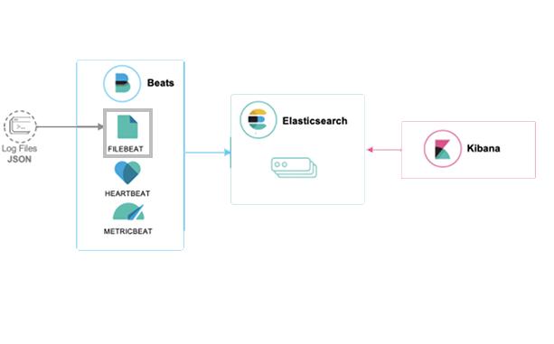

 <a name="top"></a>
# TFM VIU 2022
## _Tutora: Inmaculada del Valls_
## _Masterando: Enrique Prieto Catalán_

Trabajo Final de Máster de Big Data/Data Science de Enrique Prieto Catalán en el que se va a ejecutar el stack mediante Docker Compose.
* El objetivo es la prueba de concepto de la instalación de la aplicación para Observabilidad del stack en un grupo de servidores.
* En este TFM se realizará la prueba de concepto (PoC) que mostrará las capacidades básicas del Stack Elastic para ingesta de logs que permitan la observabilidad de un grupo de servidores._
 ---
 
<a name="indice"></a>
## Índice de contenidos
1. [ Requisitos y asunciones](#item1)
2. [ Instalación del Stack Elastic](#item2)
   - En este apartado, se instala y arranca un stack elastic con un clúster de un nodo de [Elasticsearch](https://www.elastic.co/guide/en/elasticsearch/reference/7.3/index.html) y una instancia de [Kibana](https://www.elastic.co/guide/en/kibana/7.3/index.html).
3. [ Modelado Simple de Logs](#item3)
   - Modelamos los campos y creamos una pipeline
4. [ Modelado Simple de Logs con Filebeat](#item4)
   - Modelamos los campos y creamos una pipeline de procesos
5. [ Activación de acción](#item5) 
   - Damos órdenes de activación a partir de algunos resultados, comenzando por el envío de un mensaje al operador. 
6. [ Siguientes pasos](#item6)

---

<a name="item1"></a> [Volver a Índice](#indice)
 ### 1. Requisitos y asunciones
- Se basa en la versión 7.17.5 del stack. Configurada en el fichero [.env](../.env).
- Docker y Docker Compose. Se ha probado con docker versión 19.03.2 y docker-compose 1.24.1.
  - Usuarios de Windows y Mac users tendrán Compose instalado automáticamente con Docker para [Windows](https://docs.docker.com/docker-for-windows/install/)/[Mac](https://docs.docker.com/docker-for-mac/install/).
  - Los usuarios de Linux puede leer las [instrucciones de instalación](https://docs.docker.com/compose/install/#install-compose) o pueden instalar vía `pip`:
  
    ```shell
    pip install docker-compose
    ```

- Un mínimo de 4GB de RAM para contenedores. Los usuarios de Mac y Windows deben configurar su máquina virtual Docker para disponer de ese mínimo.

    

- Debido a que que por defecto la [memoria virtual](https://www.elastic.co/guide/en/elasticsearch/reference/7.3/vm-max-map-count.html) no es suficiente, los usuarios de Linux deben ejecutar el siguiente comando como `root`:

```
sysctl -w vm.max_map_count=262144
```
- Para iniciar el stack, es necesario que no haya ningún servicio arrancado en los puertos 9200, 9300 (elasticsearch), 5601 (kibana).


---

<a name="item2"></a> [Volver a Índice](#indice)
 ### 2. Instalación del Stack Elastic
Trataremos de instalar los servicios necesarios para lograr la siguiente estructura de ejecución: 


Para ello este apartado efectuaremos lo siguente:
 - Instalar un conjunto de contenedores en los que se encuentra elasticsearch, kibana y filebeat
 - Arrancar dichos servicios, comprobando que funcionan correctamente
 - Probar explorando Kibana [^DiscoverKibana]

## INSTALACIÓN DEL STACK
Comenzamos ejecutando desde el raíz del proyecto:

```shell
docker-compose up -d
```
Con ello instalamos el stack elastic definido en [docker-compose.yml](../../docker-compose.yml).

## COMPROBACIONES
Ejecutaremos `docker ps` para comprobar que tenemos 3 contenedores en estado healthy (filebeat, kibana, elasticsearch).

Podemos también comprobar, en los logs de los respectivos servicios, si han arrancado correctamente.

```shell
docker logs -f elasticsearch
docker logs -f kibana
docker logs -f filebeat
```

## Visualización vía Logs UI
A continuación, abriremos la URL de Kibana en un navegador (ver [supported browsers](https://www.elastic.co/es/support/matrix#matrix_browsers)).

- http://localhost:5601/
- Usuario: elastic
- Password: changeme


Volvemos a Kibana, y selecionamos en el menú de la izquierda `Logs`.


Veremos logs logs que están entrando en el sistema generados por Flog.


Si pulsamos en la esquina superior derecha, `Stream Live`, se irán actualizando los logs a medida que llegan a elasticsearch.

También podemos modificar el tamaño de letra de los logs, si queremos hacer wrapping, etc. con la opción del menú `Customize`.


Pulsando en `Configuration`, se puede modificar que [índices](https://www.elastic.co/guide/en/elasticsearch/reference/6.2/_basic_concepts.html#_index) de elasticsearch kibana nos va a mostrar, el campo a usar como `timestamp`, etc. Interesante en la configuración, ir a la segunda pestaña, `Log Columns`, donde podemos indicar qué campos queremos mostrar en la pantalla.

Dado que no tenemos el campo `event.dataset`...


lo podemos eliminar y guardar con `Update source`.


A partir de aquí la vista de los logs presentará el siguiente aspecto.


Podemos igualmente usar la barra de búsqueda superior para filtrar los logs. En los ejemplos, buscamos el texto `override the driver` o `calculate`.


Para pasar al siguiente apartado, pararemos filebeat ejecutando:

```shell
docker-compose stop filebeat
```

Y en Kibana borraremos el índice generado para los logs de Filebeat. Para ello, selecciona en el menú izquierdo `Management`.


Selecciona `Index Management` en el grupo Elasticsearch.


Y borra el índice o índices `filebeat`.


 
[Subir](#top)
 
---

<a name="item3"></a> [Volver a Índice](#indice)
### 3. Modelado Simple de Logs

Hemos ingestado en elastic nuestros logs sin modelar, sin estructura. Es decir, dado un log con el formato:

```json
{"timestamp":1569939745276,"message":"27 Dec 2020 03:09:29 () [k6A:2394036:srm2:prepareToGet:-1093710432:-1093710431 k6A:2394036:srm2:prepareToGet SRM-grid002] Pinning failed for /pnfs/ft.uam.es/data/atlas/atlasdatadisk/rucio/mc16_13TeV/ce/13/EVNT.23114463._000856.pool.root.1 (File is unavailable.)"}
```

o:

```
27 Dec 2020 03:09:29 () [k6A:2394036:srm2:prepareToGet:-1093710432:-1093710431 k6A:2394036:srm2:prepareToGet SRM-grid002] Pinning failed for /pnfs/ft.uam.es/data/atlas/atlasdatadisk/rucio/mc16_13TeV/ce/13/EVNT.23114463._000856.pool.root.1 (File is unavailable.)
```

El documento que hemos acabado guardando en Elasticsearch tiene un campo `timestamp` con la fecha de ingesta, y un segundo campo `message` con el mensaje completo del log.

Ahora queremos separar el contenido de este campo `message`, de forma que podamos explotar obtener el `campo01`, el `campo02`, etc. Es decir, darle estructura a los datos que nos llegan.
El mensaje de ejemplo anterior debería transformarse en el siguiente:
```
srm://grid002.ft.uam.es:8443/srm/managerv2?SFN=/pnfs/ft.uam.es/data/atlas/atlasdatadisk/rucio/mc16_13TeV/ce/13/EVNT.23114463._000856.pool.root.1
```
Es decir, queremos aplicarle las siguientes operaciones:
1. Seleccionar las líneas que contengan "unavailable"
2. Seleccionar las líneas que contengan "root" en la dirección url del mensaje
3. Extraer diche url de cada mensaje, aladirle el prefijo xxx y que dicha concatenación esa el valor de un nuevo campo
4. Eliminar filas duplicadas

En lenguaje Bash, se podría expresar así, ejecutando cada línea desde un fichero independiente:
```
cat 01_srm-grid002Domain.log | grep unavailable > 02a_perdidos_conysinpool.txt
cat 02a_perdidos_conysinpool.txt | grep pool.root > 02b_perdidos.txt
cut -d ' ' -f 12 02b_perdidos.txt > 03_nombres_.txt
nombres=$(cat 03_nombres.txt)
for f in $nombres; do echo "srm://grid002.ft.uam.es:8443/srm/managerv2?SFN=$f" >> "04_preparados.txt"; done
cat 04_preparados.txt | sort | uniq > "05_listos.txt"
```
<!-- Esto es un comentario de prueba de Enrique -->

Ejemplo de referencia multilínea [^nota1].  


Así podremos agrupar valores similares, visualizarlos, y explotar toda la potencia de nuestros logs. Nos permitirá contestar preguntas como ¿Cuáles son los errores más habituales?¿cuánta es su repetición? ¿En qué momentosa se producen? (`campo 01`, `campo02`, ...).

Para ello, necesitaremos conocer la **estructura** de nuestros logs, e indicársela a Elasticsearch.

[Subir](#top)

---

<a name="item4"></a> [Volver a Índice](#indice)
### 4. Modelado Simple de Logs con Filebeat
En este punto, el documento que llega a elastic tiene este aspecto:

```json
{"timestamp" : 1569846065739,
"message" : "srm://grid002.ft.uam.es:8443/srm/managerv2?SFN=/pnfs/ft.uam.es/data/atlas/atlasdatadisk/rucio/mc16_13TeV/ce/13/EVNT.23114463._000856.pool.root.1"}
```

Y nos gustaría que en elastic se guardara como:

```json
{
          "@timestamp" : "30 Dec 2020 01:56:30",
          "enri_campo02" : "()",
          "enri_campo03" : "[3Bs:6871:srm2:prepareToGet:-1093078942:-1093078941 3Bs:6871:srm2:prepareToGet",
          "enri_campo04" : "[3Bs:6871:srm2:prepareToGet",
          "enri_campo05" : "SRM-grid002]",
          "enri_campo06" : "Pinning",
          "enri_campo07" : "failed",
          "enri_campo08" : "for",
          "enri_campo09" : "/pnfs/ft.uam.es/data/ops/nagios-argo-mon.egi.cro-ngi.hr/arcce/srm-input",
          "enri_campo010" : "(File",
          "enri_campo011" : "is ",
          "enri_campo012" : "unavailable.)",
          "enri_campo013" : "",
          "enri_prefifo" : "srm://grid002.ft.uam.es:8443/srm/managerv2?SFN=",
          "enri_prefijo_mas_ruta" : "srm://grid002.ft.uam.es:8443/srm/managerv2?SFN=",
          "timestamp" : 1569846065739
}
```

Para realizar esta transformación, recurriremos a las [pipelines](https://www.elastic.co/guide/en/elasticsearch/reference/7.3/pipeline.html) de ingesta de elasticsearch, que se ejecutarán en los [nodos llamados de ingesta](https://www.elastic.co/guide/en/elasticsearch/reference/7.3/ingest.html).

Dado que tenemos un cluster elasticsearch con un sólo nodo, este nodo realizará todos los roles (master, data, ingest, etc.). Más información sobre roles de los nodos en la [documentación](https://www.elastic.co/guide/en/elasticsearch/reference/7.3/modules-node.html).

Las pipelines de ingesta proporcionan a elasticsearch un mecanismo para procesar previamente los documentos antes de almacenarlos. Con una pipeline, podemos analizar sintácticamente, transformar y enriquecer los datos de entrada a través de un conjunto de [procesadores](https://www.elastic.co/guide/en/elasticsearch/reference/7.3/ingest-processors.html) que se aplican de forma secuencial a los documentos de entrada, para generar el documento definitivo que almacenará elasticsearch.


En este apartado realizaremos:

1. Ingesta de logs estruturados usando la pipeline de ingesta de elasticsearch.
2. Visualización de logs en Kibana Discover.

## Creación de la pipeline de ingesta

En primer lugar, vamos a crear una simple pipeline de ingesta, basada en un procesador de tipo [dissect](https://www.elastic.co/guide/en/elasticsearch/reference/7.3/dissect-processor.html), que nos parseará el campo `message` de entrada generando los diversos campos que queremos a la salida (`process_name`, `process_id`, `host_name`, etc).

Antes de crear esta pipeline, es interesante simular cual sería su comportamiento. Para ello, en Kibana seleccionaremos en el menú de la izquierda `Dev Tools`.


Y pegaremos lo siguiente en la consola:

```json
POST _ingest/pipeline/_simulate
{
  "pipeline": {
    "description": "_description",
    "processors": [
      {
        "dissect": {
          "field": "message",
          "pattern": "%{@timestamp} %{host_name} %{process_name} %{process_id} %{message_id} %{event_data} %{message_content}"
        }
      },
      {
        "remove": {
          "field": "message"
        }
      }
    ]
  },
  "docs": [
    {
      "_source": {
        "timestamp" : 1569846065739,
        "message" : "2019-09-30T12:21:04.702Z leadengage.info omnis 7009 ID418 - Connecting the microchip won't do anything, we need to override the auxiliary PNG protocol!"
      }
    }
  ]
}
```

Al ejecutar esta petición, podremos comprobar si el JSON resultante es el esperado.


Esta petición [simula](https://www.elastic.co/guide/en/elasticsearch/reference/7.3/simulate-pipeline-api.html) una pipeline, usando el endpoint del API REST de elasticsearch `_ingest/pipeline/_simulate`. En el contenido del cuerpo, tenemos un JSON con los procesadores de la pipeline:

- [**dissect**](https://www.elastic.co/guide/en/elasticsearch/reference/7.3/dissect-processor.html): Se encarga de separar el texto que viene en el campo message a partir de los espacios en blanco, y crea distintos campos (timestamp, host_name, process_name, etc.) con los valores que extrae del campo message de entrada.
- [**remove**](https://www.elastic.co/guide/en/elasticsearch/reference/7.3/remove-processor.html): eliminará el campo `message` ya que, una vez modelado, no nos interesa guardara esta información redundante.

Una vez comprobamos que la pipeline de ingesta funciona según deseamos, la daremos de alta en elasticsearch para poder usarla. Para ello, en la misma consola de Dev Tools, ejecutaremos:

```json
PUT _ingest/pipeline/logs-pipeline
{
  "description": "Pipeline para TFM",
  "processors": [
    {
      "dissect": {
        "field": "message",
        "pattern": "%{@timestamp} %{enri_campo02} %{enri_campo03} %{enri_campo04} %{enri_campo05} %{enri_campo06} %{enri_campo07} %{enri_campo08} %{enri_campo09} %{enri_campo10} %{enri_campo11} %{enri_campo12}"
      }
    },
    {
      "set": {
        "field": "enri_prefijo",
        "value": "srm://grid002.ft.uam.es:8443/srm/managerv2?SFN="
      }
    },
   {
      "append": {
        "field": "enri_prefijo_mas_ruta",
        "value": [
          "{{enri_prefijo}}",
          "{{enri_campo12}}"
        ]
      }
    },
   {
      "join": {
        "field": "enri_prefijo_mas_ruta",
        "separator": ""
      }
    },
    {
      "remove": {
        "field": "message"
      }
    }
  ]
}
```

Creando la pipeline de ingesta **logs-pipeline**, que usaremos en el próximo apartado.


## Configuracion de Filebeat

Ahora tenemos que indicar a elasticsearch que los documentos que vayan a ser almacenados en los índices creados por filebeat deben pasar primero esta pipeline que los va a transformar. Para ello, editaremos el fichero de configuración de filebeat. [filebeat/config/filebeat.yml](../../filebeat/config/filebeat.yml), y en la sección `output.elasticsearch` descomentaremos la línea `pipeline: logs-pipeline`.

```yaml
output.elasticsearch:
  hosts: ["elasticsearch:9200"]
  username: '${ES_USERNAME:elastic}'
  password: '${ES_PASSWORD:changeme}'
  pipeline: logs-pipeline
```

## Ingesta de logs estructurados

Y arrancar de nuevo `filebeat`.

```shell
docker-compose up -d
```

Podemos comprobar que no haya errores en la ejecución de filebeat, antes de pasar al siguiente apartado:

```shell
docker logs -f filebeat
```

## Visualizar logs en Discover

Volvemos a Kibana.

Para visualizar los logs debemos primero crear un [Index Pattern](https://www.elastic.co/guide/en/kibana/7.3/tutorial-define-index.html). Los index patterns nos permiten acceder desde Kibana a los índices en elasticsearch, y, por lo tanto, a los documentos que tenemos almacenados en estos índices.

Si no le indicamos lo contrario en la configuración de filebeat para envío a elasticsearch, los índices que se crearán son con el nombre `filebeat-*`.


Por lo tanto, en la sección de Management de Kibana, seleccionamos `Index Patterns` en el grupo `Kibana`.


Pulsamos el botón azul `Create Index Pattern` y damos de alta un patrón `filebeat-*`.


Hacemos clic en `Next step`y seleccionaremos el campo a usar para mostrar la serie temporal de datos en Discover. En
este caso, escogemos `@timestamp`.


Y pulsamos `Create Index Pattern`.

Seleccionamos en el menú de la izquierda en Kibana `Discover`.

Hacemos clic en `New` en el menú superior, para limpiar cualquier filtro que tuviéramos en la búsqueda.

Y en el selector escogemos el index pattern que acabamos de crear, `filebeat-*`.


Es posible usar la barra de búsqueda para filtrar nuestros datos. Por ejemplo, seleccionar `event_data:` y nos proporcionará sugerencias para filtrar la búsqueda. En el ejemplo, podemos filtrar por `event_data: "ID222" or event_data: "ID638"`


El lenguage usado para filtrar las búsquedas es [Kibana Query Language (KQL)](https://www.elastic.co/guide/en/kibana/7.3/kuery-query.html).

**Eliminamos** el filtro de las búsquedas para recuperar todos los datos.

Finalmente, vamos a crear una tabla para utilizarla en la construcción del Dashboard en el siguiente apartado. Queremos una vista que nos muestre `host_name` y `process_name`. En la lista de campos disponibles, localizamos esos campos y pulsamos el botón azul `add` para ambos.


El resultado será una tabla como la siguiente.


Pulsaremos el botón `Save` en la barra superior y guardaremos la búsqueda con el nombre `[Filebeat] Host/Process`


## Finalizamos

---

<a name="item5"></a> [Volver a Índice](#indice)
 ### 5. [ Activación de acción](#item5) 
   - Damos órdenes de activación a partir de algunos resultados, comenzando por el envío de un mensaje al operador. 
   - 
   - 
   - 
   - 

---

<a name="item6"></a> [Volver a Índice](#indice)
 ### 6.  Siguientes pasos 
   - 
   - 
   - 
   - 
   - 
   - 
   - 
   -
   -   
   -   


---
[^nota1]: Cada línea extrade estas notas empicezan con doble espacio.  
  Esta línea empezó con doble espacio.
[^nota2]: vista de [Discover](https://www.elastic.co/guide/en/kibana/7.3/discover.html) en Kibana
[^nota3]: Prueba

[Subir](#top)

